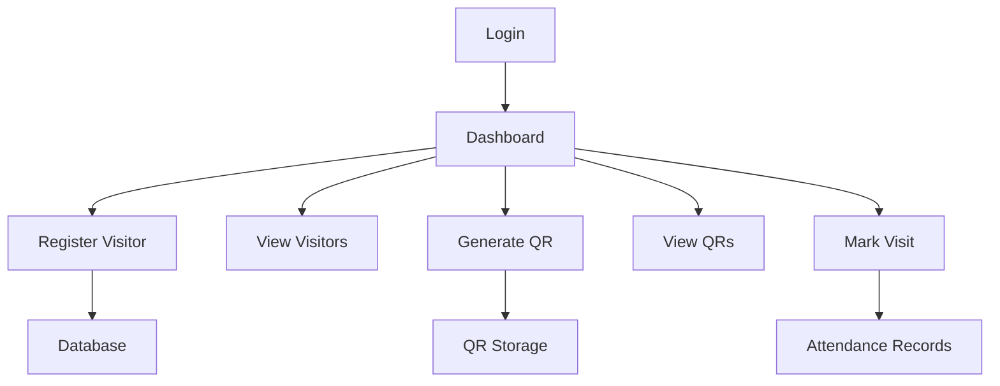

# Visitor Management System


A comprehensive visitor management solution with QR code-based Visit tracking and digital record-keeping.


## Features

### 🛡️ Secure Login
- Admin authentication with credentials
- Hardcoded credentials (default: `btechdays`/`btechdays`)

### 📋 Visitor Registration
- Capture visitor details (Name, Email, Contact, etc.)
- Image upload functionality
- Unique registration ID generation
- Database storage with MySQL

### 🖼️ Visitor Management
- View all registered visitors
- Search/filter visitors
- Display visitor images
- Tabular data presentation

### 🔳 QR Code System
- Generate QR codes with visitor data
- Save QR codes to local storage
- Browse generated QR codes
- QR code preview functionality

### 🎥 Attendance Tracking
- Webcam-based QR scanning
- Automatic check-in/check-out
- Duration calculation (minimum 5 minutes)
- Attendance records storage
- Real-time clock display

### 📊 Database Management
- MySQL backend
- Two main tables:
  - `userdetails`: Stores visitor information
  - `userattendance`: Tracks visit records

## Workflow Diagram



## Technology Stack

- **Core Language**: Java 17
- **GUI Framework**: Java Swing
- **Database**: MySQL 8.0
- **QR Generation**: ZXing Library
- **Webcam Integration**: Webcam Capture API
- **JSON Handling**: Google Gson

---

## Installation Guide

### Prerequisites

- **Java JDK 17+**
- **MySQL Server 8.0+**
- **Maven 3.6+**

### Database Setup

#### Create MySQL Database:

```sql
CREATE DATABASE visitor_db;
USE visitor_db;
```

#### Create Tables:

```sql
CREATE TABLE userdetails (
  id INT AUTO_INCREMENT PRIMARY KEY,
  name VARCHAR(255) NOT NULL,
  gender VARCHAR(10),
  email VARCHAR(255) UNIQUE,
  contact VARCHAR(15),
  hostEmployeeDetails VARCHAR(255),
  companyName VARCHAR(255),
  country VARCHAR(255),
  uniqueregid VARCHAR(255),
  imagename VARCHAR(255)
);

CREATE TABLE userattendance (
  id INT AUTO_INCREMENT PRIMARY KEY,
  userid INT NOT NULL,
  date DATE NOT NULL,
  checkin DATETIME,
  checkout DATETIME,
  workduration VARCHAR(100)
);
```

### Configuration

Update database credentials in `ConnectionProvider.java`:

```java
Class.forName("com.mysql.cj.jdbc.Driver");
Connection con = DriverManager.getConnection(
    "jdbc:mysql://localhost:3306/visitor_db", 
    "root", 
    "your_password"
);
```

### Dependencies

Add the following dependencies to `pom.xml`:

```xml
<dependencies>
    <!-- MySQL Connector -->
    <dependency>
        <groupId>mysql</groupId>
        <artifactId>mysql-connector-java</artifactId>
        <version>8.0.28</version>
    </dependency>
    
    <!-- Webcam Capture -->
    <dependency>
        <groupId>com.github.sarxos</groupId>
        <artifactId>webcam-capture</artifactId>
        <version>0.3.12</version>
    </dependency>
    
    <!-- QR Code Generation -->
    <dependency>
        <groupId>com.google.zxing</groupId>
        <artifactId>core</artifactId>
        <version>3.4.1</version>
    </dependency>
</dependencies>
```

---

## Usage

### Login
- Run `Login.java` and enter your credentials.

### Dashboard
Navigate through buttons to access features:
- 🆕 **Register Visitor**: Collect new visitor data.
- 👀 **View Visitors**: Browse/search existing records.
- 🔳 **Generate QR**: Create visitor QR codes.
- 📋 **View QRs**: Access generated QR images.
- ✅ **Mark Visit**: Webcam-based attendance.

### QR Operations
- Generate QR from the visitor list.
- Save to the default location or custom path.
- Preview before saving.

### Visit Tracking
- Automatic check-in on first scan.
- Checkout after a minimum of **5 minutes**.
- Visual feedback with timestamps.

---

## Project Structure

```
visitor-management/
├── src/
│   ├── forms/          # GUI Forms
│   │   ├── Dashboard.java
│   │   ├── Login.java
│   │   └── ...         
│   ├── dao/            # Database
│   │   └── ConnectionProvider.java
│   └── utility/        # Helpers
│       └── BDUtility.java
├── images/             # Visitor photos
├── qrCodes/            # Generated QR codes
└── lib/                # External JARs
```
